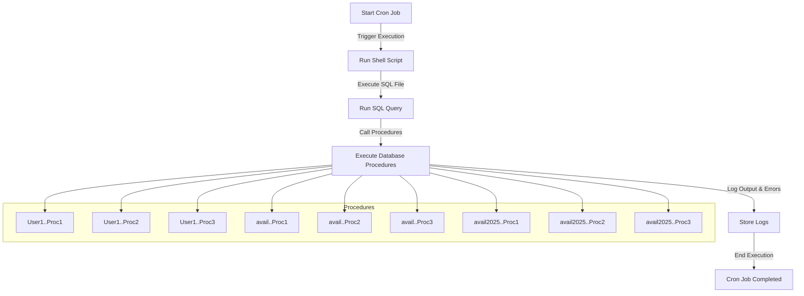

```mermaid
graph TD
    A["Start Cron Job"] -->|Trigger Execution| B["Run Shell Script"]
    B -->|Execute SQL File| C["Run SQL Query"]
    C -->|Call Procedures| D["Execute Database Procedures"]
    
    subgraph Procedures
        D1["User1..Proc1"]
        D2["User1..Proc2"]
        D3["User1..Proc3"]
        D4["avail..Proc1"]
        D5["avail..Proc2"]
        D6["avail..Proc3"]
        D7["avail2025..Proc1"]
        D8["avail2025..Proc2"]
        D9["avail2025..Proc3"]
    end
    
    D --> D1
    D --> D2
    D --> D3
    D --> D4
    D --> D5
    D --> D6
    D --> D7
    D --> D8
    D --> D9
    
    D -->|Log Output & Errors| E["Store Logs"]
    E -->|End Execution| F["Cron Job Completed"]
```
