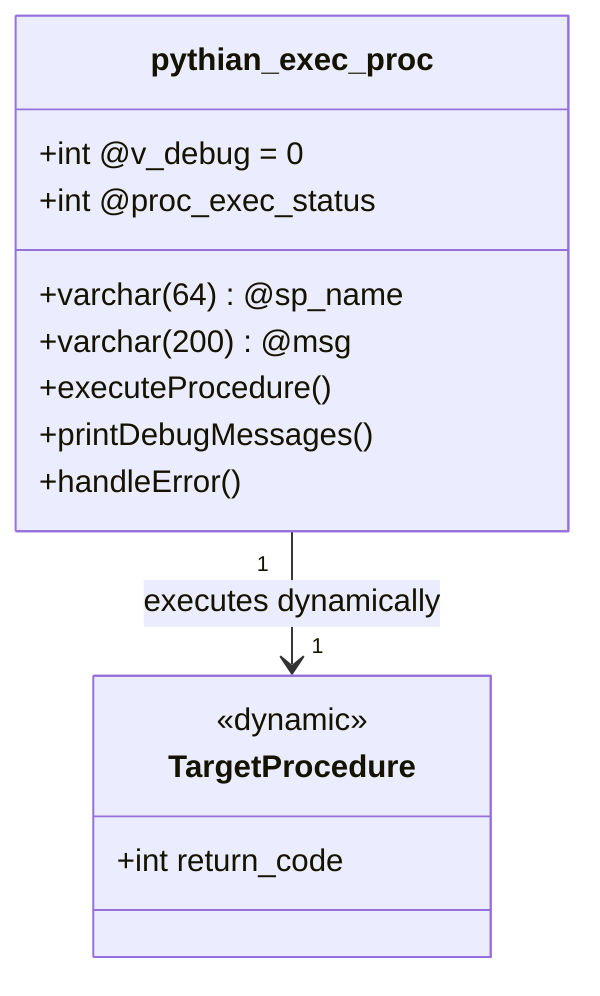

```mermaid
classDiagram
    class pythian_exec_proc {
        +varchar(64) @sp_name
        +int @v_debug = 0
        +int @proc_exec_status
        +varchar(200) @msg
        +executeProcedure()
        +printDebugMessages()
        +handleError()
    }

    class TargetProcedure {
        <<dynamic>>
        +int return_code
    }

    pythian_exec_proc "1" --> "1" TargetProcedure : executes dynamically

```