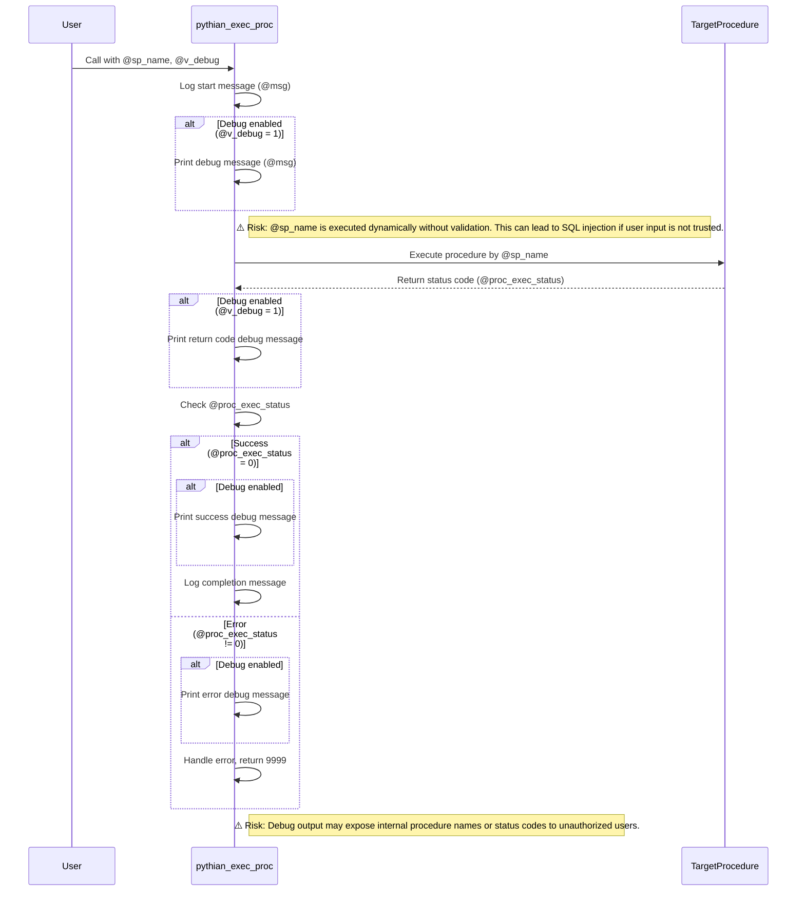

```mermaid
sequenceDiagram
    participant User
    participant pythian_exec_proc
    participant TargetProcedure

    User->>pythian_exec_proc: Call with @sp_name, @v_debug
    pythian_exec_proc->>pythian_exec_proc: Log start message (@msg)
    alt Debug enabled (@v_debug = 1)
        pythian_exec_proc->>pythian_exec_proc: Print debug message (@msg)
    end
    %% Potential Security Vulnerability: No validation or sanitization of @sp_name input
    Note right of pythian_exec_proc: ⚠️ Risk: @sp_name is executed dynamically without validation. This can lead to SQL injection if user input is not trusted.
    pythian_exec_proc->>TargetProcedure: Execute procedure by @sp_name
    TargetProcedure-->>pythian_exec_proc: Return status code (@proc_exec_status)
    alt Debug enabled (@v_debug = 1)
        pythian_exec_proc->>pythian_exec_proc: Print return code debug message
    end
    pythian_exec_proc->>pythian_exec_proc: Check @proc_exec_status
    alt Success (@proc_exec_status = 0)
        alt Debug enabled
            pythian_exec_proc->>pythian_exec_proc: Print success debug message
        end
        pythian_exec_proc->>pythian_exec_proc: Log completion message
    else Error (@proc_exec_status != 0)
        alt Debug enabled
            pythian_exec_proc->>pythian_exec_proc: Print error debug message
        end
        pythian_exec_proc->>pythian_exec_proc: Handle error, return 9999
    end
    %% Potential Security Vulnerability: Debug messages may leak sensitive info
    Note right of pythian_exec_proc: ⚠️ Risk: Debug output may expose internal procedure names or status codes to unauthorized users.
```    