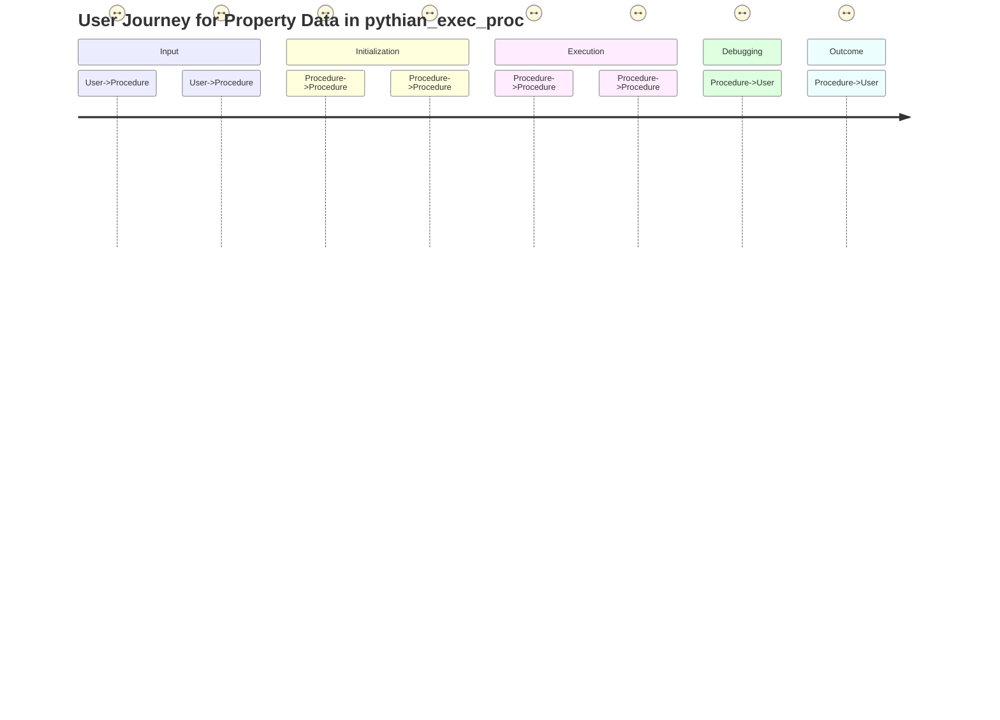

```mermaid
journey
    title User Journey for Property Data in pythian_exec_proc

    section Input
      User->Procedure: Provides @sp_name (procedure name)
      User->Procedure: Provides @v_debug (debug flag)

    section Initialization
      Procedure->Procedure: Initializes @msg (message variable)
      Procedure->Procedure: Initializes @proc_exec_status (status variable)

    section Execution
      Procedure->Procedure: Uses @sp_name to execute target procedure
      Procedure->Procedure: Stores result in @proc_exec_status

    section Debugging
      Procedure->User: Uses @v_debug to decide if debug messages (@msg) are printed

    section Outcome
      Procedure->User: Returns success or error based on @proc_exec_status

```