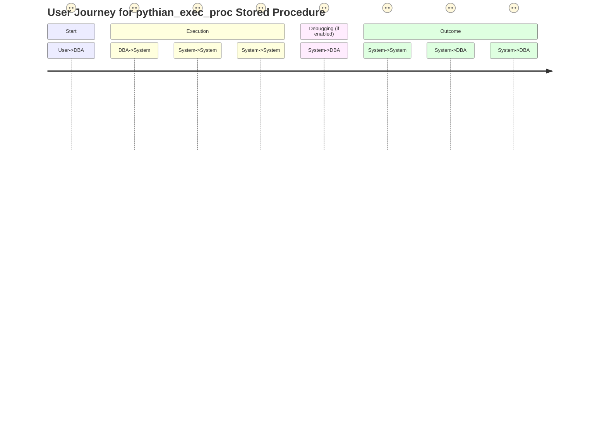

```mermaid
journey
    title User Journey for pythian_exec_proc Stored Procedure

    section Start
      User->DBA: Calls pythian_exec_proc with procedure name and debug flag

    section Execution
      DBA->System: Procedure logs start message
      System->System: Procedure executes target stored procedure dynamically
      System->System: Captures return code

    section Debugging (if enabled)
      System->DBA: Prints debug messages

    section Outcome
      System->System: Checks return code
      System->DBA: Logs success if return code is 0
      System->DBA: Logs error and handles failure if return code is non-zero
```